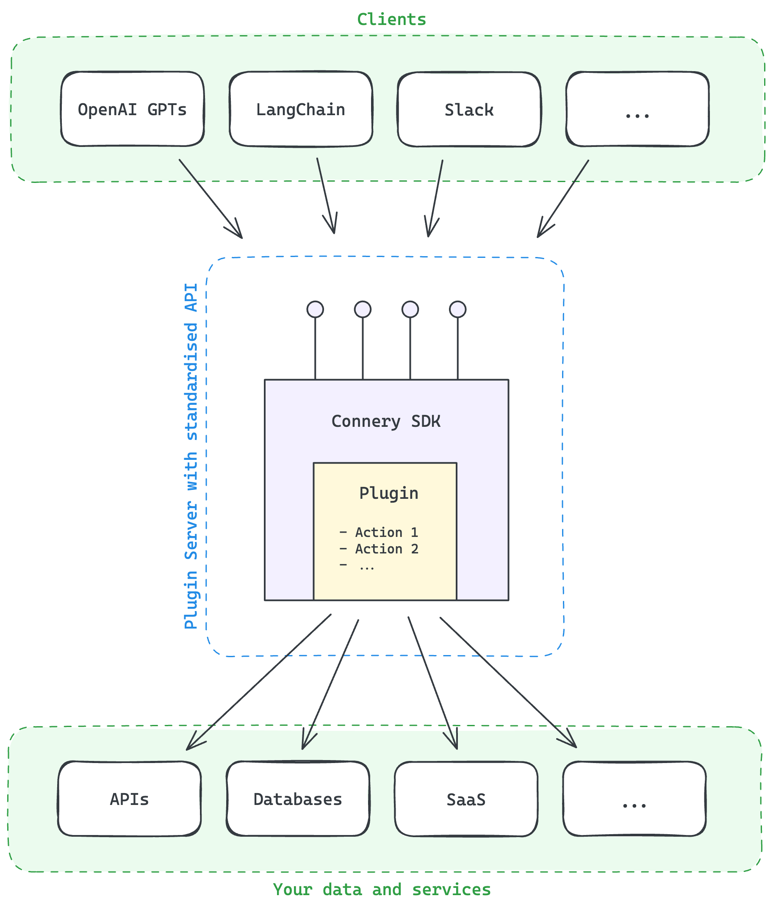

# The open-source SDK for AI plugins and actions development

[](https://github.com/connery-io/connery/releases)
[](https://github.com/connery-io/connery/blob/main/LICENSE)

## 🤔 What is this? - TODO

**With Connery, you can create plugins and use them across many platforms.
Connery will handle the rest: isolated runtime, authorization, secret management, access management,
audit logs, and other [vital features](#-features).**

Many AI platforms are gaining momentum on the market — for instance, OpenAI GPTs,
LangChain, AI-powered chatbots, agents and wearable devices.

To fully leverage the capabilities of these platforms, it's essential to connect them with the real world:
SaaS applications, APIs, databases, and so on.

While APIs provide a fundamental bridge for connectivity,
they alone aren't sufficient to connect the real world to the AI platforms.
The AI platforms require a new type of infrastructure capable of handling plugin-related challenges,
such as authorization, secret management, access management, and other vital features, ensuring robust security and control.

This is where Connery comes into play.



Connery consists of four main components that tightly work together:

**Plugin ecosystem**

- **Action** - Think of an action as a basic task, something like a function with input and output parameters designed to do one specific thing.
  For example, "Send email" is an action in the ["Gmail"](https://github.com/connery-io/gmail) _plugin_.

- **Plugin** - This is a collection of related actions grouped together because they serve a similar purpose.
  Each plugin is represented by a GitHub repository with TypeScript code of a specific structure.
  Plugin must be installed on a _runner_ before its actions can be used.

**Plugin infrastructure**

- **Runner** - This is the heart of Connery, an open-source application that knows how to handle plugins and run actions.
  It's equipped with a user interface and and a set of features for connection management, personalization, and safety.
  Each organization or individual can configure their own isolated runner with a unique plugin set and configuration.
  The runner provides a standardized API for every installed action that can be consumed by _clients_.

- **Client** - A client is a specific application for each platform that uses the API provided by the runner.
  It's like a translator that adapts the runner's capabilities to fit the platform's needs.
  For example, an [OpenAI GPTs](https://sdk.connery.io/docs/clients/openai/gpt) client allows you to run
  Connery actions from OpenAI GPT, or a [Slack](https://sdk.connery.io/docs/clients/slack) client
  will enable you to run Connery actions directly from Slack.
  Also, there are clients you can use to call actions from your own applications, such as [LangChain](https://sdk.connery.io/docs/clients/langchain/toolkit) or [API](https://sdk.connery.io/docs/clients/api) clients.

The combination of these components allows you to run actions from any platform supported by Connery. For example, you can run the same Connery action using OpenAI GPT, LangChain, Slack, and [other clients](https://sdk.connery.io/docs/clients/).

## 🚀 Quickstart

Initialize a new plugin with a sample action:

```bash
npx connery@latest dev init
```

Install the dependencies:

```bash
npm install
```

Run the plugin server:

```bash
npm start
```

Open the plugin in the browser: [localhost:4201](http://localhost:4201).

👉 _Check out the [full quickstart guide](https://sdk.connery.io/docs/quickstart/) to learn more._

## ✅ Usage Example 1: Send email from an OpenAI GPT


Learn more: [OpenAI GPT client](https://sdk.connery.io/docs/clients/openai/gpt).

## ✅ Usage Example 2: Summarize a webpage and send it by email from OpenGPTs


Learn more: [LangChain OpenGPTs client](https://sdk.connery.io/docs/clients/langchain/opengpts).

## ✅ Usage Example 3: Scale back-end service on AWS from Slack


Learn more: [Slack client](https://sdk.connery.io/docs/clients/slack).

## 🌟 Support us and stay up-to-date

Please **give the repository a star** to support the project and stay up-to-date with the latest news.


## 💡 Use cases

- [Actions in GPTs](https://sdk.connery.io/docs/use-cases/actions-in-gpts/)
- [Actions in AI agents and apps](https://sdk.connery.io/docs/use-cases/actions-in-ai-agents-and-apps/)
- [Actions in AI wearables](https://sdk.connery.io/docs/use-cases/actions-in-ai-wearables/)
- [Actions in team collaboration tools](https://sdk.connery.io/docs/use-cases/actions-in-team-collaboration-tools/)
- [Custom actions in No-Code tools](https://sdk.connery.io/docs/use-cases/custom-actions-in-no-code-tools/)
- [Actions in CI/CD pipelines](https://sdk.connery.io/docs/use-cases/actions-in-ci-cd-pipelines)

## 📖 Documentation

Check out the [documentation](https://sdk.connery.io) to learn more.

## 💬 Feedback & Support

Connery is still in early beta, so not everything is perfect yet. Please let us know of any suggestions, ideas, or bugs you encounter, and we will use your feedback to improve our upcoming releases.

You can reach us via the following channels:

- [Discussions](https://github.com/connery-io/connery/discussions) - for feedback, questions, and discussions.
- [Issues](https://github.com/connery-io/connery/issues) - for bug reports and feature requests.
- [Twitter](https://twitter.com/connery_io) - for updates and announcements.

## 🗄️ Repository structure

This is a monorepo that contains the following components:

| Name                | Path                 | Description                                                                                                                            |
| ------------------- | -------------------- | -------------------------------------------------------------------------------------------------------------------------------------- |
| SDK&nbsp;&&nbsp;CLI | `./packages/connery` | The [`connery`](https://www.npmjs.com/package/connery) package that contains both the SDK and CLI for plugins and actions development. |
| Docs                | `./apps/docs`        | The [documentation](https://sdk.connery.io/) website.                                                                                  |

## 👨‍💻 Contributing

We are open to contributions, whether it be in the form of a new feature, improved infrastructure, or better documentation.

For detailed information on how to contribute, see our [contributing guide](/CONTRIBUTING.md).
