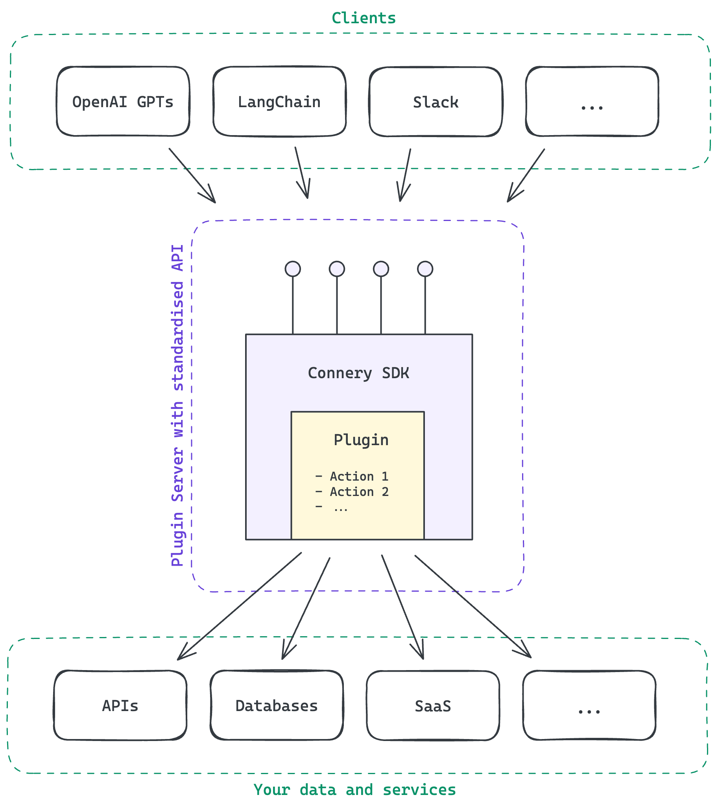
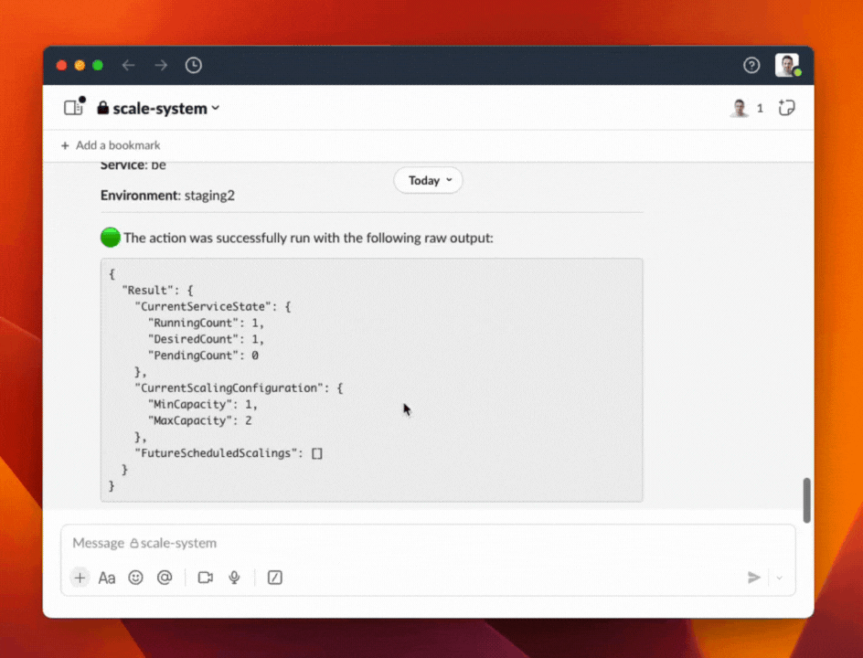

<div align="center">

# The open-source SDK for<br>creating AI plugins and actions

[](https://github.com/connery-io/connery-sdk/releases)
[](https://github.com/connery-io/connery-sdk/blob/main/LICENSE)

</div>

## 🤔 What is Connery SDK?

Connery SDK is an NPM package that includes both an SDK and a CLI, designed for the development
of [plugins](https://docs.connery.io/sdk/get-started/core-concepts#plugin)
and [actions](https://docs.connery.io/sdk/get-started/core-concepts#action).

The CLI automates many things in the development process.
Meanwhile, the SDK offers a JavaScript API for defining plugins and actions and packaging them
into a [plugin server](https://docs.connery.io/sdk/get-started/core-concepts#plugin-server) with a standardized REST API generated from the metadata.
The plugin server handles authorization, input validation, and logging.
So you can focus on the logic of your actions.

~~The standardized API enables various clients to interact
with actions in a unified way, regardless of the underlying implementation.~~

An action consists of JavaSctipt code that defines its logic and metadata that describes its input and output.
The action can communicate with external APIs, databases, or other services.

👉 _Example: [Send email](https://github.com/connery-io/gmail/blob/main/src/actions/sendEmail.ts)
is an action in the [connery-io/gmail](https://github.com/connery-io/gmail) plugin._

<div align="center">
  
</div>

## 🚀 Quickstart

Initialize a new plugin with a sample action:

```bash
npx connery@latest dev init
```

Install the dependencies:

```bash
npm install
```

Run the plugin server:

```bash
npm start
```

Open the plugin in the browser: [localhost:4201](http://localhost:4201).

👉 _Check out the [full quickstart guide](https://docs.connery.io/sdk/guides/create-a-plugin) to learn more._

## ✅ Example: Scale back-end service on AWS from Slack



👉 _Learn more: Slack client._

## 🌟 Support us and stay up-to-date

Please **give the repository a star** to support the project and stay up-to-date with the latest news.


## 📖 Documentation

Check out the [documentation](https://docs.connery.io/sdk) to learn more.

## 💬 Feedback & Support

Connery is still in early beta, so not everything is perfect yet. Please let us know of any suggestions, ideas, or bugs you encounter, and we will use your feedback to improve our upcoming releases.

You can reach us via the following channels:

- [Discussions](https://github.com/connery-io/connery-sdk/discussions) - for feedback, questions, and discussions.
- [Issues](https://github.com/connery-io/connery-sdk/issues) - for bug reports and feature requests.
- [Twitter](https://twitter.com/connery_io) - for updates and announcements.

## 🗄️ Repository structure

This is a monorepo that contains the following components:

| Name                | Path                 | Description                                                                                                                            |
| ------------------- | -------------------- | -------------------------------------------------------------------------------------------------------------------------------------- |
| SDK&nbsp;&&nbsp;CLI | `./packages/connery` | The [`connery`](https://www.npmjs.com/package/connery) package that contains both the SDK and CLI for plugins and actions development. |
| Docs                | `./docs`             | The [documentation](https://docs.connery.io/sdk) website.                                                                              |

## 👨‍💻 Contributing

We are open to contributions, whether it be in the form of a new feature, improved infrastructure, or better documentation.

For detailed information on how to contribute, see our [contributing guide](/CONTRIBUTING.md).
