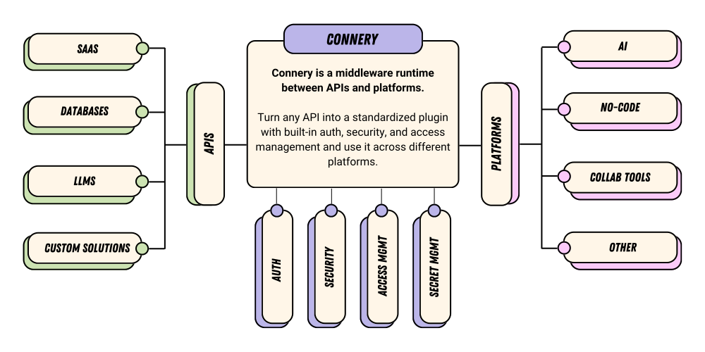

# Connery - Plugin infrastructure for AI

 

## 🤔 What is this?

**Connery is a middleware runtime between APIs and platforms. With Connery, you can turn any API into a standardized plugin with built-in auth, security, and access management and use it across different platforms.**

Many **AI platforms** are gaining momentum on the market — for instance, OpenAI with GPTs, LangChain, AI-powered chatbots, and agents.

Also, many **no-code platforms**, such as Zapier and Make, allow you to connect different services together and build automation workflows.

To fully leverage the capabilities of these platforms, it's essential to connect them with your APIs, like SaaS applications, databases, back-end services, and so on.

While APIs provide a fundamental bridge for connectivity, their integration often requires customization into platform-specific applications, adhering to diverse platform standards. This necessity introduces a complex array of challenges, particularly in areas of authentication, security, and access management, which are critical for seamless and secure operations.

This is where Connery comes into play.

## ⚙️ How does it work?

Connery consists of four main components that tightly work together:

**Action** - Think of an action as a basic task, something like a function with input and output parameters designed to do one specific thing.
For example, "Send an email" is an action in the "Gmail" _plugin_.

**Plugin** - This is a collection of related actions grouped together because they serve a similar purpose.
Each plugin is represented by a GitHub repository with TypeScript code of a specific structure.
Plugin must be installed on a _runner_ before its actions can be used.

**Runner** - This is the heart of Connery, an open-source application that knows how to handle plugins and run actions.
It's equipped with key features like authentication handling, security, and access management.
Each organization or individual configures their own isolated runner with a unique plugin set and configuration.
The runner provides a standardized API for every installed action that can be consumed by _clients_.

**Client** - A client is a specific application for each platform that uses the API provided by the runner.
It's like a translator that adapts the runner's capabilities to fit the platform's needs.
For example, a Slack App client allows to run actions right from Slack.

The combination of these components allows you to run actions from any platform supported by Connery. For example, you can run the same action from Slack, OpenAI GPT or Make.

## ✅ Example 1: Send email from a custom OpenAI GPT using Connery actions

Learn more: [Send email from a custom OpenAI GPT using Connery actions](https://docs.connery.io/docs/platform/use-cases/send-email-from-a-custom-openai-gpt-using-connery-actions).

## ✅ Example 2: Scale back-end service on AWS from Slack

Learn more: [Scale back-end service on AWS from Slack](https://docs.connery.io/docs/platform/use-cases/scale-back-end-service-on-aws-from-slack).

## 🌟 Support us and stay up-to-date

Please **give the repository a star** to support the project and stay up-to-date with the latest news.

## ✨ Features

| Feature                        | Description                                                                                                              |
| ------------------------------ | ------------------------------------------------------------------------------------------------------------------------ |
| Auth                           | Authentication and authorization management.                                                                             |
| Security                       | Robust, enterprise-grade security measures ensuring data protection and privacy.                                         |
| Access Management              | Flexible, role-based access controls allowing fine-tuned permissions for actions.                                        |
| Secret Management              | Advanced and secure handling of sensitive data, such as API keys, passwords, and tokens.                                 |
| Action Manual Approval         | Empower humans with the final say in executing actions, ensuring accuracy and relevance, especially when AI is involved. |
| AI Readiness                   | Future-proof architecture primed for integration with intelligent AI agents and chatbots.                                |
| Open-source Plugin Marketplace | Dive into a rich ecosystem of plugins, expand functionalities and customize to your heart's content.                     |
| Multi-Platform Plugins         | Unprecedented compatibility with diverse platforms, ensuring smooth operations regardless of your tech stack.            |

Please note that many features are still in development and will be released in the upcoming versions.

## 🌳 Ecosystem

We aim to build a community-driven ecosystem of open-source plugins and clients around Connery.
We believe that collective development accelerates innovation.

Our vision is to build a marketplace where you can find open-source plugins and clients for any use case.

Below are manually curated lists of plugins and clients available for Connery:

- [Native plugins](https://docs.connery.io/docs/plugins/native)
- [Community plugins](https://docs.connery.io/docs/plugins/community)
- [Native clients](https://docs.connery.io/docs/clients/native)
- [Community clients](https://docs.connery.io/docs/clients/community)

To add your plugin or client to the lists, see our [contributing guide](/CONTRIBUTING.md).

## 🚀 Quickstart

Check out the [Quickstart](https://docs.connery.io/docs/platform/quick-start/) guide to get started with Connery.

## 📖 Documentation

Check out the [Documentation](https://docs.connery.io) to learn more.

## 💬 Feedback & Support

Connery is still in beta, so not everything will be perfect yet. Please let us know of any suggestions, ideas, or bugs you encounter, and we will use your feedback to improve our upcoming releases.

You can reach us via the following channels:

- [Discussions](https://github.com/connery-io/connery-platform/discussions) - for feedback, questions, and discussions.
- [Issues](https://github.com/connery-io/connery-platform/issues) - for bug reports and feature requests.
- [Twitter](https://twitter.com/connery_io) - for updates and announcements.

## 🗄️ Repository structure

This is a monorepo that contains the following components:

| Name   | Path                 | Description                                                                                                     |
| ------ | -------------------- | --------------------------------------------------------------------------------------------------------------- |
| Runner | `./apps/runner`      | The core of Connery that knows how to handle plugins, run actions, and provide a standardized API as an output. |
| Docs   | `./apps/docs`        | The documentation website.                                                                                      |
| CLI    | `./packages/connery` | CLI for plugin development.                                                                                     |
| SDK    | `./packages/sdk`     | SDK for plugin development.                                                                                     |
| Lib    | `./packages/lib`     | Shared library for the runner and CLI.                                                                          |

## 👨‍💻 Contributing

We are extremely open to contributions, whether it be in the form of a new feature, improved infrastructure, or better documentation.

For detailed information on how to contribute, see our [contributing guide](/CONTRIBUTING.md).
