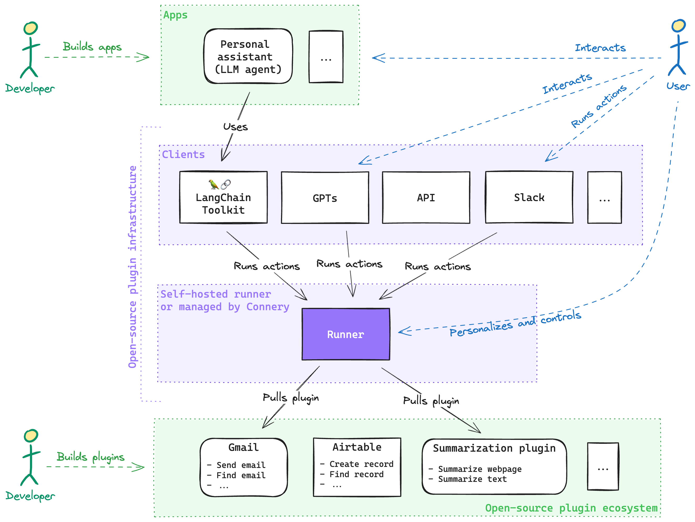

# Connery - Plugin infrastructure for AI

## 🤔 What is this?

**With Connery, you can create plugins and use them across many platforms.
Connery will handle the rest: isolated runtime, authorization, secret management, access management,
audit logs, and other [vital features](#-features).**

Many AI platforms are gaining momentum on the market — for instance, OpenAI GPTs,
LangChain, AI-powered chatbots, agents and wearable devices.

To fully leverage the capabilities of these platforms, it's essential to connect them with the real world:
SaaS applications, APIs, databases, and so on.

While APIs provide a fundamental bridge for connectivity,
they alone aren't sufficient to connect the real world to the AI platforms.
The AI platforms require a new type of infrastructure capable of handling plugin-related challenges,
such as authorization, secret management, access management, and other vital features, ensuring robust security and control.

This is where Connery comes into play.

## ⚙️ How does it work?

Connery consists of four main components that tightly work together:

**Plugin ecosystem**

- **Action** - Think of an action as a basic task, something like a function with input and output parameters designed to do one specific thing.
  For example, "Send email" is an action in the ["Gmail"](https://github.com/connery-io/gmail) _plugin_.

- **Plugin** - This is a collection of related actions grouped together because they serve a similar purpose.
  Each plugin is represented by a GitHub repository with TypeScript code of a specific structure.
  Plugin must be installed on a _runner_ before its actions can be used.

**Plugin infrastructure**

- **Runner** - This is the heart of Connery, an open-source application that knows how to handle plugins and run actions.
  It's equipped with a user interface and and a set of features for connection management, personalization, and safety.
  Each organization or individual can configure their own isolated runner with a unique plugin set and configuration.
  The runner provides a standardized API for every installed action that can be consumed by _clients_.

- **Client** - A client is a specific application for each platform that uses the API provided by the runner.
  It's like a translator that adapts the runner's capabilities to fit the platform's needs.
  For example, an [OpenAI GPTs](https://docs.connery.io/docs/clients/openai/gpt) client allows you to run
  Connery actions from OpenAI GPT, or a [Slack](https://docs.connery.io/docs/clients/slack) client
  will enable you to run Connery actions directly from Slack.
  Also, there are clients you can use to call actions from your own applications, such as [LangChain](https://docs.connery.io/docs/clients/langchain/toolkit) or [API](https://docs.connery.io/docs/clients/api) clients.

The combination of these components allows you to run actions from any platform supported by Connery. For example, you can run the same Connery action using OpenAI GPT, LangChain, Slack, and [other clients](https://docs.connery.io/docs/clients/).

## 💡 Use cases

- [Actions in GPTs](https://docs.connery.io/docs/use-cases/actions-in-gpts/)
- [Actions in AI agents and apps](https://docs.connery.io/docs/use-cases/actions-in-ai-agents-and-apps/)
- [Actions in AI wearables](https://docs.connery.io/docs/use-cases/actions-in-ai-wearables/)
- [Private AI-actions control center](https://docs.connery.io/docs/use-cases/private-ai-actions-control-center/)
- [Automations in Team Collaboration tools](https://docs.connery.io/docs/use-cases/automations-in-team-collaboration-tools/)
- [Custom actions in No-Code tools](https://docs.connery.io/docs/use-cases/custom-actions-in-no-code-tools/)
- [CI/CD automations](https://docs.connery.io/docs/use-cases/ci-cd-automations/)

## ✅ Example 1: Summarize a webpage and send it by email from OpenGPTs

Learn more: [LangChain OpenGPTs client](https://docs.connery.io/docs/clients/langchain/opengpts).

## ✅ Example 2: Send email from an OpenAI GPT

Learn more: [OpenAI GPT client](https://docs.connery.io/docs/clients/openai/gpt).

## ✅ Example 3: Scale back-end service on AWS from Slack

Learn more: [Slack client](https://docs.connery.io/docs/clients/slack).

## 🌟 Support us and stay up-to-date

Please **give the repository a star** to support the project and stay up-to-date with the latest news.

## ✨ Features

### Plugin infrastructure and runtime

- **Runtime** for plugins’ code and **runtime isolation** for every user.
- **Plugin authorization** with third-party services using OAuth, API Keys, etc.
- **Multiple action types** to handle different integration challenges: CRUD actions, async actions, trigger actions, etc.
- **Tooling** and **Developer Experience** for plugin development like CLI, SDK, documentation, SDLC, versioning, ecosystem, community, and support to let developers concentrate on what matters the most.

### Personalization and security

- **Authentication, authorization,** and a **management interface** for users to manage connections and personalization.
- **Connection management**: Users need a secure way to authorize AI-powered apps to access their services, such as Gmail, using OAuth. For services not supporting OAuth, like AWS, secure storage of access keys is essential through **Secrets Management**.
- **Personalization**: The user can configure and personalize integrations. For example, specify a custom signature for all the emails. Or personalize metadata for actions so LLMs better understand the personal use case. They can also provide personal information such as name and email so LLMs can use it as additional context when calling actions.

### AI safety and control

- **Metadata** allows LLMs to better understand available actions and consequently reduce the error rate in selecting and executing them. It includes an action description with a clear purpose, an input schema describing the available parameters and validation rules, and the action outcome.
- **Human-in-the-loop** to empower the user with the final say in executing actions (depending on criticality). Also, editing suggested input parameters before running an action, for example, reviewing an email before sending.
- **Audit logs** for consistency, compliance, and transparency.

Please note that Connery is still in early beta, so not all features are available yet.
This list represents our vision for the future of Connery.
We're working hard to make it a reality.

The order of features does not represent the priority.

## 🌳 Ecosystem

We aim to build a community-driven ecosystem of open-source plugins and clients around Connery.
We believe that collective development accelerates innovation.

Our vision is to build a marketplace where you can find open-source plugins and clients for any use case.

Below are manually curated lists of plugins and clients available for Connery:

- [Plugins](https://docs.connery.io/docs/plugins/)
- [Clients](https://docs.connery.io/docs/clients/)

To add your plugin or client to the lists, see our [contributing guide](/CONTRIBUTING.md).

## 🚀 Quickstart

Check out the [Quickstart](https://docs.connery.io/docs/runner/quick-start/) guide to get started with Connery.

## 📖 Documentation

Check out the [Documentation](https://docs.connery.io) to learn more.

## 💬 Feedback & Support

Connery is still in early beta, so not everything will be perfect yet. Please let us know of any suggestions, ideas, or bugs you encounter, and we will use your feedback to improve our upcoming releases.

You can reach us via the following channels:

- [Discussions](https://github.com/connery-io/connery/discussions) - for feedback, questions, and discussions.
- [Issues](https://github.com/connery-io/connery/issues) - for bug reports and feature requests.
- [Twitter](https://twitter.com/connery_io) - for updates and announcements.

## 🗄️ Repository structure

This is a monorepo that contains the following components:

| Name | Path             | Description                                                                                            |
| ---- | ---------------- | ------------------------------------------------------------------------------------------------------ |
| Docs | `./apps/docs`    | The [documentation](https://docs.connery.io/) website.                                                 |
| CLI  | `./packages/cli` | [`connery`](https://www.npmjs.com/package/connery) CLI package for plugin development.                 |
| SDK  | `./packages/sdk` | [`@connery-io/sdk`](https://www.npmjs.com/package/@connery-io/sdk) SDK package for plugin development. |

## 👨‍💻 Contributing

We are extremely open to contributions, whether it be in the form of a new feature, improved infrastructure, or better documentation.

For detailed information on how to contribute, see our [contributing guide](/CONTRIBUTING.md).
