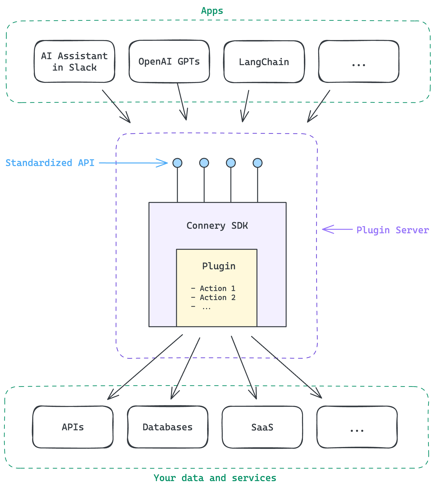

<div align="center">

# The open-source SDK for<br>creating AI plugins and actions

[](https://github.com/connery-io/connery-sdk/releases)
[](https://github.com/connery-io/connery-sdk/blob/main/LICENSE)

</div>

## 🤔 What is Connery SDK?

The Connery SDK is an NPM package that combines an SDK and a CLI, designed to streamline the development of [plugins](https://docs.connery.io/sdk/get-started/core-concepts#plugin) and [actions](https://docs.connery.io/sdk/get-started/core-concepts#action) for AI apps.

The CLI automates the development process, while the SDK provides a JavaScript API for defining plugins and actions. It also simplifies packaging them into a [plugin server](https://docs.connery.io/sdk/get-started/core-concepts#plugin-server) with a standardized REST API generated from metadata. The plugin server takes care of authorization, input validation, and logging, allowing you to focus on the core logic of your actions.

This standardized API ensures that various [apps](https://docs.connery.io/sdk/get-started/core-concepts#app) can interact with actions in a consistent way, regardless of their implementation.

An action consists of JavaScript code that defines its logic and metadata describing its input and output. Actions can interact with external APIs, databases, or other services.

For example, [Send email](https://github.com/connery-io/gmail/blob/main/src/actions/sendEmail.ts)
is an action in the [connery-io/gmail](https://github.com/connery-io/gmail) plugin.

<div align="center">
  
</div>

## 🚀 Quickstart

Initialize a new plugin with a sample action:

```bash
npx connery@latest dev init
```

Install the dependencies:

```bash
npm install
```

Run the plugin server:

```bash
npm start
```

[Explore](http://localhost:4201) the plugin in a browser and use it in AI apps.

👉 Check out the [full quickstart guide](https://docs.connery.io/sdk/guides/create-a-plugin) to learn more.

## ✅ Example 1: Send email from an OpenAI GPT


## ✅ Example 2: Summarize a webpage and send it by email from OpenGPTs


## ✅ Example 3: Scale back-end service on AWS from Slack


## 🌟 Support us and stay up-to-date

Please **give the repository a star** to support the project and stay up-to-date with the latest news.


## 📖 Documentation

Check out the [documentation](https://docs.connery.io/sdk) to learn more.

## 💬 Feedback & Support

Connery is still in early beta, so not everything is perfect yet. Please let us know of any suggestions, ideas, or bugs you encounter, and we will use your feedback to improve our upcoming releases.

You can reach us via the following channels:

- [Discussions](https://github.com/connery-io/connery-sdk/discussions) - for feedback, questions, and discussions.
- [Issues](https://github.com/connery-io/connery-sdk/issues) - for bug reports and feature requests.
- [Twitter](https://twitter.com/connery_io) - for updates and announcements.

## 🗄️ Repository structure

This is a monorepo that contains the following components:

| Name                | Path                 | Description                                                                                                                            |
| ------------------- | -------------------- | -------------------------------------------------------------------------------------------------------------------------------------- |
| SDK&nbsp;&&nbsp;CLI | `./packages/connery` | The [`connery`](https://www.npmjs.com/package/connery) package that contains both the SDK and CLI for plugins and actions development. |
| Docs                | `./docs`             | The [documentation](https://docs.connery.io/sdk) website.                                                                              |

## 👨‍💻 Contributing

We are open to contributions, whether it be in the form of a new feature, improved infrastructure, or better documentation.

For detailed information on how to contribute, see our [contributing guide](/CONTRIBUTING.md).
