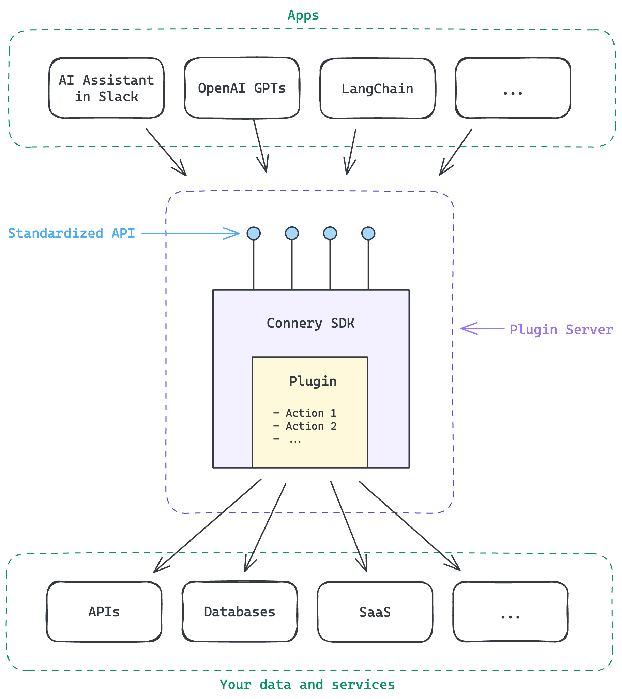

# Introduction


The open-source GitHub repository with Connery SDK: [connery-sdk](https://github.com/connery-io/connery-sdk).


The Connery SDK is an NPM package that combines an SDK and a CLI, designed to streamline the development of [plugins](get-started/core-concepts.md#plugin) and [actions](get-started/core-concepts.md#plugin) for AI apps.

The CLI automates the development process, while the SDK provides a JavaScript API for defining plugins and actions. It also simplifies packaging them into a [plugin server](get-started/core-concepts.md#plugin-server) with a standardized REST API generated from metadata. The plugin server takes care of authorization, input validation, and logging, allowing you to focus on the core logic of your actions.

This standardized API ensures that various [apps](get-started/core-concepts.md#app) can interact with actions in a consistent way, regardless of their implementation.

An action consists of JavaScript code that defines its logic and metadata describing its input and output. Actions can interact with external APIs, databases, or other services.&#x20;

For example, [Send email](https://github.com/connery-io/gmail/blob/main/src/actions/sendEmail.ts) is an action in the [connery-io/gmail](https://github.com/connery-io/gmail) plugin.

<figure><figcaption></figcaption></figure>
